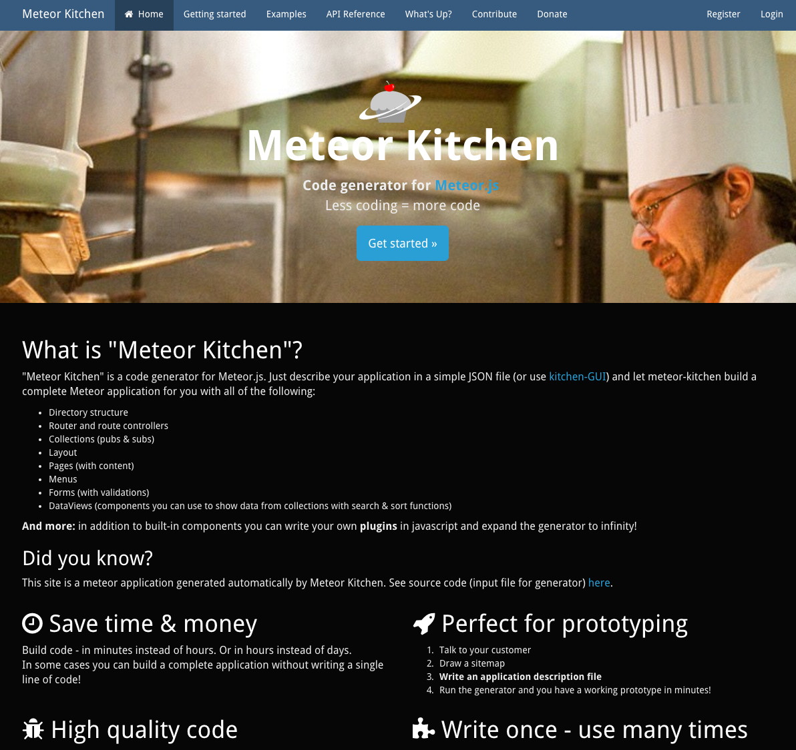

#[fit] Meteor Kitchen 

#[fit] Cooking!

### @besutome

### #meteorjs_jp

---

###[fit] [Meteor Kitchen](http://www.meteorkitchen.com/)



---

## What's The Meteor Kitchen?
<br>

```sh
$ curl http://www.meteorkitchen.com/install | /bin/sh
$ vim myapp.json
$ meteor-kitchen myapp.json myapp
$ cd myapp && meteor
```

## Complete!

---

^ プロトタイピングに最適
^ 高品質なコード コンポーネントと呼ばれる部品を使ってアプリを生成
^ 一度書けば何度でも使える

## Save time & money
## <br>
## Perfect for prototyping
## <br>
## High quality code
## <br>
## Write once - use many times

---

```json
{
    "application": {
        "free_zone": {
            "pages": [
                { "name": "home", "title": "Home page" },
                { "name": "about", "title": "About" }
            ],

            "components": [
                {
                    "name": "main_menu",
                    "type": "menu",
                    "items": [
                        { "title": "Home page", "route": "home" },
                        { "title": "About", "route": "about" }
                    ]
                }
            ]
        }
    }
}
```

---

## input file structure

+ *application.pages.name (home)*
  - home.html, home.js, home_controller.js
+ *filenames and route names are* **snake_case**
+ *template names are* **CamelCase**


----

## Frontend framework

^ デフォルトはbootstrap3

```json
{
    "application": {
        "frontend": "bootstrap3"
    }
}
```
```json
{
    "application": {
        "frontend": "semantic-ui"
    }
}
```
```json
{
    "application": {
        "frontend": "materialize"
    }
}
```

---

# collections

```json
{
    "collections": [
      {
        "name": "notes",
        "before_insert_code": "doc.name = Meteor.user() ? Meteor.user().profile.name : 'Anonymous'; return doc;",
        "owner_field": "createdBy",
        "roles_allowed_to_read": [],
        "roles_allowed_to_insert": [],
        "roles_allowed_to_update": [
          "owner"
        ],
        "roles_allowed_to_delete": [
          "owner"
        ]
      }
    ]
}
```

---

# queries

```json
{
    "queries": [
      {
        "name": "current_user_data",
        "collection": "users",
        "filter": {
          "_id": "Meteor.userId()"
        },
        "find_one": true,
        "options": {}
        }
      }
}
```
---

# pages

```json
{ "pages": [ {
          "name": "home_free",
          "text": "",
          "components": [
            {
              "name": "photo_button",
              "html": "",
              "type": "custom_component"
            },
            {
              "name": "form",
              "mode": "insert",
              "submit_route": "home_free",
              "type": "form",
              "query_name": "notes_empty",
              "fields": [
                {
                  "name": "text",
                  "title": "Or enter a note:",
                  "type": "string",
                  "required": true,
                  "input": "textarea"
                } ] },
            ] } ] }
```

---

# html

*title*

```html
<h5>Hey developer, programming all day (and night) long?</h5>
<h4>Show us your tired face! :)</h4>
```

*html*

```html
<template name=\"TEMPLATE_NAME\">\n
  {{#each notes}}\n
    \t<div class=\"panel\" style=\"padding: 0 10px;\">\n
    {{#if photo}}\n
      \n
    {{else}}\n
      <p>{{text}}</p>\n
    {{/if}}\n
    <p class=\"text-muted\">{{name}}, {{livestamp createdAt}}</p>\n
    </div>\n
  {{/each}}\n
</template>"
```

---

# components

```json
{
          "components": [
            {
              "name": "side_menu",
              "type": "menu",
              "class": "nav nav-stacked nav-pills",
              "items": [
                {
                  "title": "Profile",
                  "route": "user_settings.profile"
                },
                {
                  "title": "Change password",
                  "route": "user_settings.change_pass"
                }
              ]
            }
          ]
}
```
---

# summary

<br>

^ なれないと結構きつい
^ 結局手直しは必要
^ OAuthやユーザーロールによるアクセス制限もできる

+ json only
+ auto generate

**Let's Cooking**

---

###[fit] [Meteor Kitchen](http://www.meteorkitchen.com/)


