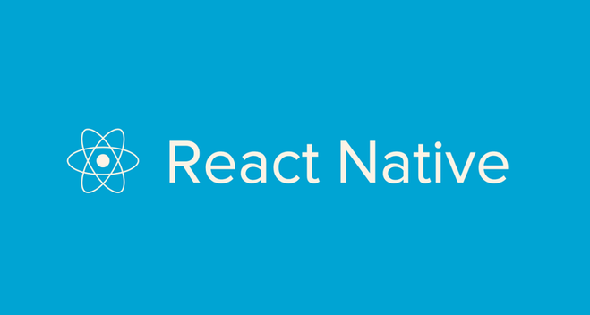
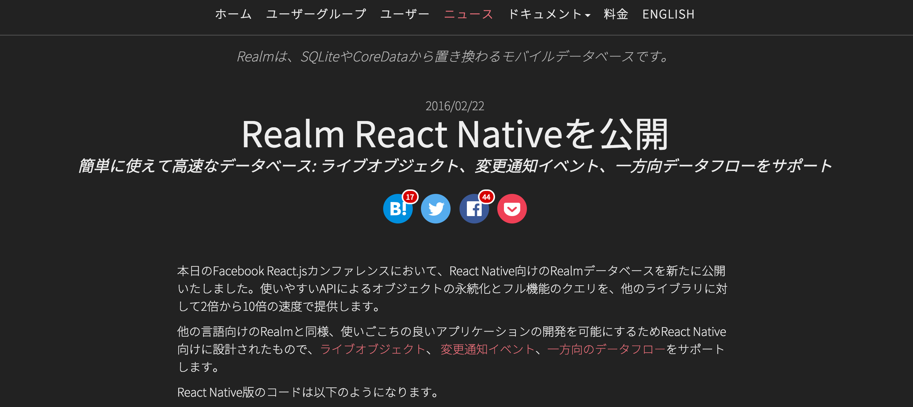
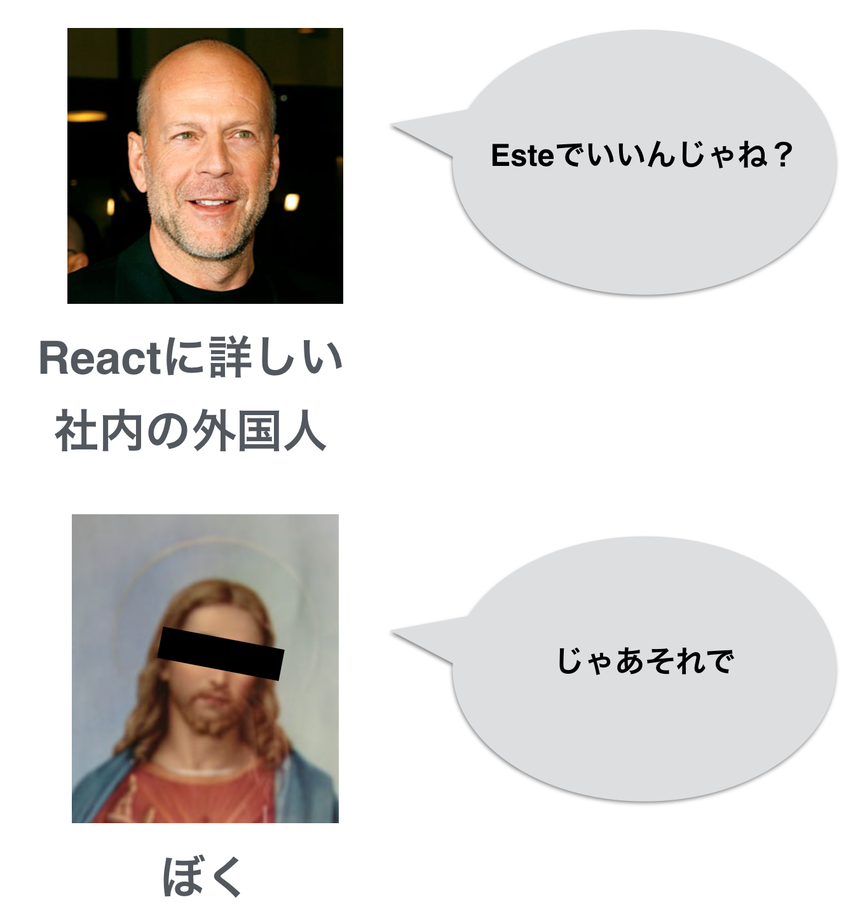

##[fit] 業務でReact Nativeを使うためのTips

### @besutome

### #reactnative_meetup

---

# @besutome

### フリーランス 
### フロントエンドエンジニア

+ 4年前に新卒で未経験でエンジニア
+ 一年でやめて起業
+ 苦しんだ結果、フリーランスへ
+ ゆるそうなのでリレーションズへ
+ React Nativeで苦しんでる

---

##[fit] smart-maint.jp
##[fit] スマートメンテ略してスマメン

---

---

## アプリ開発の背景

1. 飲食店向けのサイト（修理依頼のサイト）はもうある
2. 修理依頼は結構くるようになったけど、職人が足りない
3. 職人向けのアプリ作って、職人囲い込もう
  （クラウドソーシング）

---

## アプリの要件

+ iOS / androidの職人向けアプリリリース（できればWebも）
+ どのプラットフォームも機能は大差ない
+ B2Bなので、UXはそこまできっちりと求めなくてもいい
+ 開発期間は4,5ヶ月

---

+ 工数かかるので、ネイティブはなし
+ ハイブリッドでもいいけど、クオリティ低くなりそう
+ スマメン以外の事業部はReact使ってる

---

##[fit] React Native いけるじゃん

---

##[fit] ひたすら調査

---

## クライアントDB

+ ふつうにSQLite

---

##[fit] 古い、イケてない

---

##[fit] Realm

---

# Realm

+ イケてる
+ 新しい
+ 速い

### 要件的にクライアントに持たせるデータ多い

---

##[fit] React Native対応してなかった

## さすがにあきらめよう

---

##[fit] 諦めてから3日後...

---

---

##[fit] これは神の啓示だ

---

---

##[fit] 使う

---

## データ同期

## 各アプリとWebで同期的にデータ通信しないといけないよねえ

---

##[fit] ぼく「Firebaseあるよ」

---

##[fit] 使う

---

##[fit] fluxとか色々あるけど、どうしよう...

---

---

## アプリケーションの構成

+ REST API
+ React Native
+ Realm（イケてるクライアントDB）
+ Firebase（イケてるデータ同期用のDB）
+ Este（イケてる構成 Reduxとか）

---

##[fit] イケてるアプリ

---

+ React Ntive未経験
+ アプリ開発初めてです！
+ Realm / Firebase 使ったことないけど知ってる！
+ Reduxも知ってる！ 一方向でしょ？

---

##[fit] Q. Esteの構成が一般的なReduxと違う

---

##[fit] 長い議論の結果、Esteの構成を捨てる

---

##[fit] A. Esteが跡形もなく消える

---

##[fit] Q. ふわっとした理解のRedux

---

##[fit] A. 手さぐりでの開発

---

##[fit] Q. この機能React Nativeで、できるの？
## （とくにandroid）

---

##[fit] A. 開発しながら検証する

---

##[fit] 笑顔の絶えない楽しい職場です！

---

##[fit] 業務でReact Nativeを使うためのTips

+ はじめての技術
  + まずはミニマムで開発を回すべき
+ 土台となる構成（Esteの部分）
  + 参考にはすべきだけど、丸コピはつらい
+ React / Redux
  + 別部署で使ってるのにうまく連携できなかった...

---

##[fit] 見切り発車で最新技術選ぶと、辛いけど楽しいよ！

