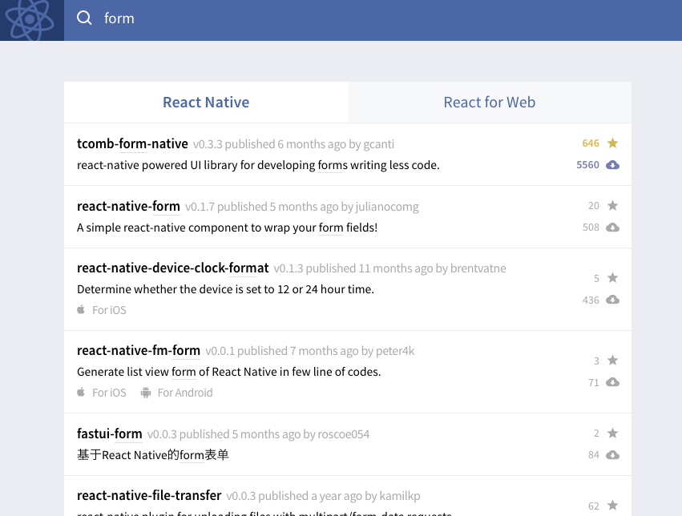
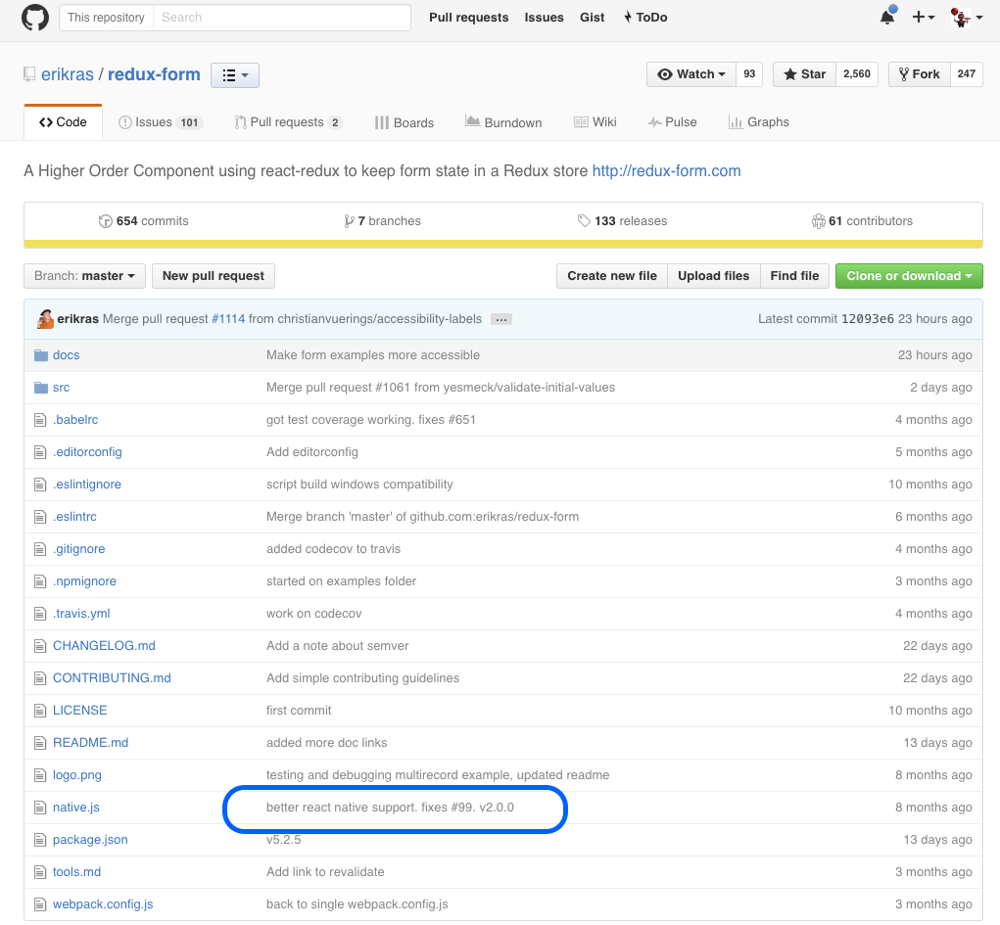
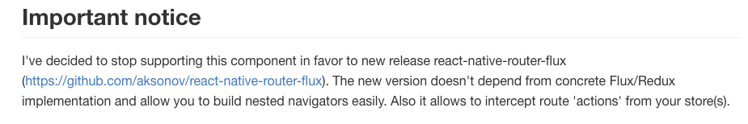

##[fit] 業務でわかったサードパーティのつらみ

---

# @besutome

### フリーランス 
### フロントエンドエンジニア

+ サービス作りたくてエンジニアへ
+ グロースハックが好きなので
  フロントエンドへ
+ コード書くの好きじゃないけど、
  新しい物は好きなので
  React Nativeやってる
+ SEOとかマーケティングのほうが
  好きだし得意

---

#[fit] React Redux

---

#[fit] React Redux npm

---

---

#[fit] サードパーティ使わなきゃいけない問題

---

## あるある

form実装しないと...

自分で書くのは辛いから
npmからもってこよう

---

---

多すぎやろ...
とりあえず有名なredux-formでググろ...

---

---

---

お前、React Nativeじゃないやん！
でばってくんな！

---

#[fit] NPM戦国時代

---

生まれては消えるパッケージ選定のTips

---

#[fit] メンテナを確認しろ！

---

他にコントリビュートしてるものを見る
reactのメンテナだったりすると安心

---

#[fit] 最終更新日を確認しろ！

---

半年くらい放置されてると危険
最近アップデートしてるとそれも危険
（すぐバージョンアップする）

---

#[fit] スター数を確認しろ！

---

---

### 500越えてたらだいたい安心
react partsのページからだと、
スター数以外にダウンロード数も見れる

---

#[fit] 別リポジトリを確認しろ！

---

パッケージを作りなおした
リポジトリがある可能性がある！

---

「古い方はもうメンテしないよ」
を新リポジトリにしか書いてなかったり
（しかも新しいほうのスター数が少ない）

---

具体例

---

#[fit] react-native-router-flux

---

---

意訳
react-native-router-flux もうサポートしねえから！
これからはreact-native-redux-router使ってくれ！

---

**スター数 6/10時点**
react-native-router-flux: 1434
react-native-redux-router: 170

---

**最終更新日 6/10時点**
react-native-router-flux: a day ago
react-native-redux-router: 20 days ago

---

react-native-router-flux もうサポートしねえから！
これからはreact-native-redux-router使ってくれ！

---

react-native-router-fluxのドキュメントにも書いてね

---

 react-native-redux-router使いましょう

---

#[fit] メンテナのSNS、ブログを確認しろ！

---

---

アカウント名でググっても
意外と情報が出てくるぞ！
（悪用厳禁）

---

1. メンテナを確認しろ！

2. 最終更新日を確認しろ！

3. スター数を確認しろ！

4. 別リポジトリを確認しろ！

5. メンテナのSNS、ブログを確認しろ！

---

蛇足

---

reduxはちゃんと設計した方がいい
propsとかstateとか

---

画面ごとに必要なパッケージも洗い出す
クライアントDBどうするか等も決める

---

#[fit] naitveコンポーネント呼び出さないように頑張る

---

そうすれば雰囲気は
ios / android共通化できる

