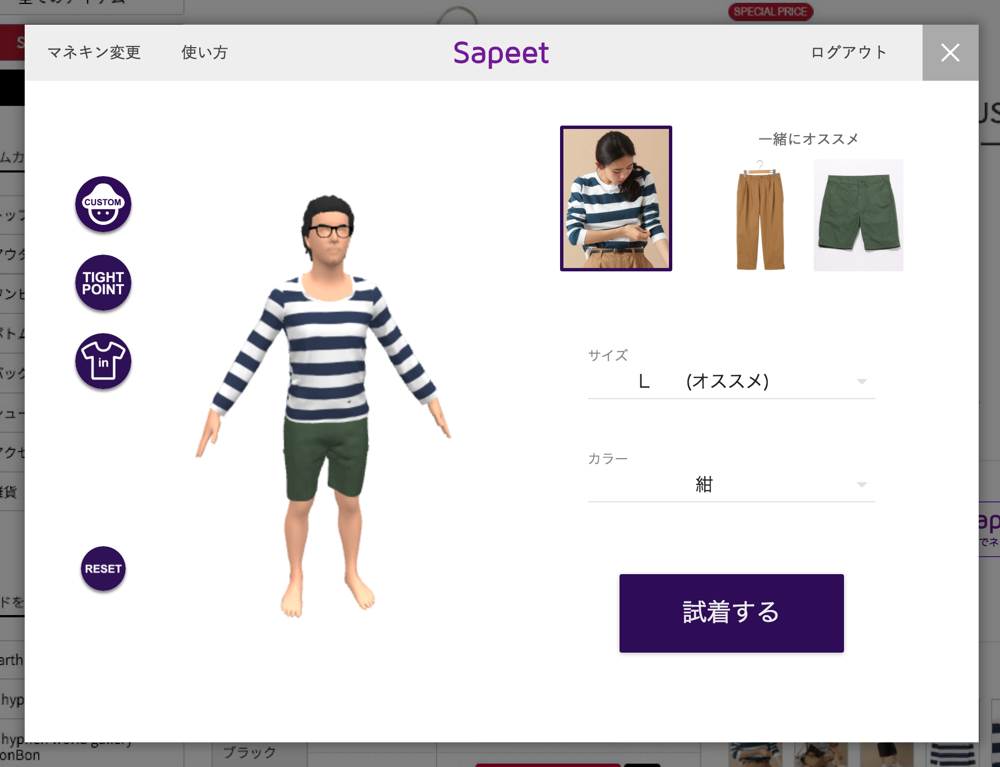
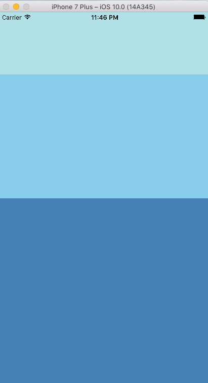
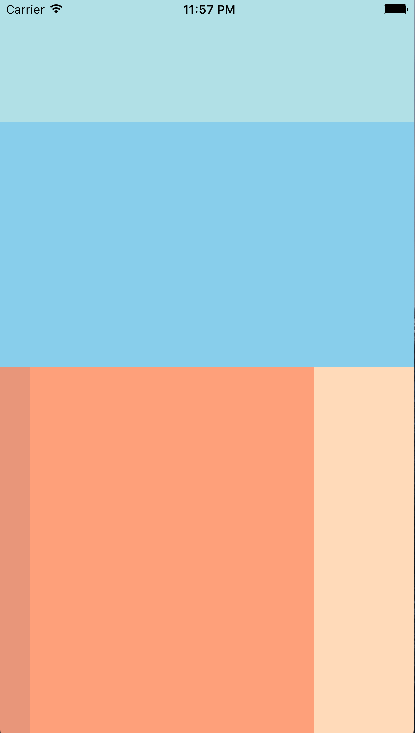

React Native ハンズオン
======

## 自己紹介

### @besutome


### 株式会社sapeet Software Developer

React Native Meetupとか主催してます。  
9月はフィリピンにシェアハウスつくりに行ってました。  
気づいたら10月からスタートアップの創業メンバーになってました。

## 株式会社sapeet

http://sappet.com


オンラインの試着サービスつくってます。  


## インストール
+ `brew install node`(v4以上 サンプルはv4.6.0)
+ `brew install watchman`
+ `npm i -g react-native-cli`
+ `react-native init test && cd test`
+ `react-native run-ios`

※ 上記で動かない場合は`npm start`後、Xcodeから`test/ios/test.xcodeproj`をビルドしてください


## 概要

### 概要

+ Reactを用いてiOSやAndroidのネイティブアプリを構築できるフレームワーク
+ JavaScriptからネイティブのAPIが呼ばれる
+ 一度覚えればどのプラットフォーム向けにも書けるようになる

※ 一度書けばどのプラットフォームでも動くわけではない

### メリット
+ ネイティブアプリがJavaScriptで書ける
+ アプリを素早くビルドできる
+ CSSのサブセットがあるため、CSSでスタイリングできる

### デメリット
+ ロジックはJavaScriptのため、重い処理が苦手
+ 複雑なUIになると、ネイティブコードを書かざるを得なくなる


## デバッグ
`⌘+D`でメニュー画面表示(iosの場合)

+ `Debug JS Remotely` - デベロッパーツールの機能が利用できる
+ `Enable Live Reload` - 保存のたびにリロードが走る（初期画面に戻る）
+ `Enable Hot Reloading` - 保存時に現在表示してる画面のままリロードが走る
+ `Show Inspector` - アプリのレイアウト確認ができる
+ `Show Perf Monitor` - パフォーマンスの確認ができる

## Reactの記法
前回のハンズオン資料参照
https://github.com/besutome/slides/tree/master/20160918-react-handson

## スタイル

### スタイルの適用

`index.ios.js`

```js
const styles = StyleSheet.create({
  container: {
    flex: 1,
    justifyContent: 'center',
    alignItems: 'center',
    backgroundColor: '#F5FCFF',
  },
  welcome: {
    fontSize: 20,
    textAlign: 'center',
    margin: 10,
  },
  instructions: {
    textAlign: 'center',
    color: '#333333',
    marginBottom: 5,
  },
});
```

```js
<View style={styles.container}>

or

<View style={{
    flex: 1,
    justifyContent: 'center',
    alignItems: 'center',
    backgroundColor: '#F5FCFF'}}>
```

変数でオブジェクトを作成し、その中でスタイルを定義します。  
スタイルを直接記述したい場合は、二重オブジェクトの中に定義します。

`fontSize`はcssの`font-size`に対応するように、スタイルはハイフンではなくキャメルケースで表現します。  
cssに対応しているものはほぼ利用可能です。

### Flexboxレイアウト

React Nativeでのレイアウトは、css flexboxと同じ設計を利用します。  
以下にいくつかの例を示します。

#### example1

```js
render() {
  return (
    <View style={{flex: 1}}>
      <View style={{flex:1, backgroundColor: 'powderblue'}} />
      <View style={{flex:2, backgroundColor: 'skyblue'}} />
      <View style={{flex:3, backgroundColor: 'steelblue'}} />
    </View>
  );
}
```



flexプロパティは要素の伸び率を指定できます。  
上記は各`<View>`コンポーネントの高さ比率を1:2:3にしています。  
親の`<View>`に`flex: 1`を指定することで、画面全体に領域を広げています。  
これによって、デバイスサイズに関係なくレイアウトすることができます。

#### example2

```js
render() {
  return (
    <View style={{flex: 1}}>
      <View style={{flex: 1, backgroundColor: 'powderblue'}} /> 
      <View style={{flex: 2, backgroundColor: 'skyblue'}} />
      <View style={{flex: 3, flexDirection: 'row'}} >
        <View style={{width: 30, backgroundColor: 'darksalmon'}} /> 
        <View style={{flex: 1, backgroundColor: 'lightsalmon'}} /> 
        <View style={{width: 100, backgroundColor: 'peachpuff'}} />
      </View> 
    </View>
  );
}

```



`flexDirection`ではflexboxで要素を並べる方向を定めることができます。  
デフォルトの縦方向が`column`、横方向が`row`です。  
要素を固定長で指定することもできます。`width: 40`など。  
他にも様々な関連プロパティがあり、柔軟にレイアウトすることができます。

### cssとの違い

cssとの違いはいくつかありますが、重要なのは`z-index`を指定できないことです。  
重ね順を変更するにはコンポーネントの順序を変えることで対応します。

## ScrollView / ListView

スクロール領域を指定したい場合は、`<ScrollView>`もしくは`<ListView>`で指定する必要があります。  
それぞれの違いは以下です。

+ `ScrollView`
  + 要素が小さくて大きさが限られたものを表示する
  + 要素は基本的に不変
+ `ListView`
  + 要素が長いリスト
  + 要素が動的に変更される

`ScrollView`の内容は端末内であらかじめ全てレンダリングされます。  
`ListView`はスクロールされた時に画面に入った要素をその都度レンダリングします。

### ScrollView

```js
import { ScrollView } from 'react-native';

class AwesomeProject extends Component {
  render() {
    return (
      <ScrollView>
        <View style={{height: 400, backgroundColor: 'powderblue'}} >
          <Text style={{fontSize: 100}}>hoge</Text>
        </View>
        <View style={{height: 400, backgroundColor: 'skyblue'}} >
          <Text style={{fontSize: 100}}>fuga</Text>
        </View>
        <View style={{height: 400, backgroundColor: 'deepskyblue'}} >
          <Text style={{fontSize: 100}}>foo</Text>
        </View>
        <View style={{height: 400, backgroundColor: 'dodgerblue'}} >
          <Text style={{fontSize: 100}}>bar</Text>
        </View>
      </ScrollView>
    );
  }
}
```

上記で画面全体をスクロールすることができます。

### ListView

`ListView`は少し複雑です。

```js
import { ListView } from 'react-native';

class AwesomeProject extends Component {
  constructor(props) {
    super(props);
    const ds = new ListView.DataSource ({
      rowHasChanged: (r1, r2) => r1 !== r2
    });

    this.state = {
      dataSource: ds.cloneWithRows ([
        {text: 'hoge', bgColor: 'powderblue'},
        {text: 'fuga', bgColor: 'skyblue'},
        {text: 'foo', bgColor: 'deepskyblue'},
        {text: 'bar', bgColor: 'dodgerblue'}
      ])
    };
  }

  render() {
    const renderRow = (rowData) =>
        <View style={{height: 400 ,backgroundColor: rowData.bgColor}} >
          <Text style={{fontSize: 100}}>{rowData.text}</Text>
        </View>

    return(
      <ListView
        dataSource={this.state.dataSource}
        renderRow={renderRow}
      />
    );
  }
}
```

まず`new ListView.DataSource()`から、初期化済みのDataSourceを用意しています。  
`rowHasChanged`の値は各データの同一性を検証する関数で、`r1`と`r2`というデータを与えた時、二つのデータが違うものかどうかを返す関数です。  
上記の例では単純に`r1`と`r2`を比較しているだけです。

そしてDataSourceに値を入れ、コンポーネントの`dataSource`Stateに設定します。  
`cloneWithRows` は自身のDataSourceを複製して、引数で与えられた値を追加したものを返します。  
そのため、`dataSource`Stateには値が入った状態のDataSourceが登録されます。

表示の際には、`<ListView>`のpropsに表示させたいデータを指定する`dataSource`とデータの表示方法を指定する`renderRow`を設定します。  

`dataSource`には`DataSource`Stateを与えています。  
`renderRow`にはデータを表示するためのコンポーネントを返す関数を与えます。

## ルーティング

React Nativeではルーティング管理のために、`Navigator`というコンポーネントを利用します。

```js
import React, { Component, PropTypes } from 'react';
import { AppRegistry, Navigator, Text, TouchableHighlight, View } from'react-native';

class MyScene extends Component{
  static propTypes = {
    title: PropTypes.string.isRequired
  };
  render() {
    return (
      <View style={{padding: 30}}>
        <Text>タイトル:{this.props.title}</Text>
      </View>
    );
  }
}

class AwesomeProject extends Component {
  render() {
    return (
      <Navigator
        initialRoute={{title: 'MyInitialScene', index: 0}}
        renderScene={ (route,navigator) =>
          <MyScene title={route.title}/>
        }
      />
    )
  }
}

AppRegistry.registerComponent('AwesomeProject',()=>AwesomeProject);
```

`<Navigator>`はPropsとして`initialRoute`と`renderScene`を受けとり、`renderScene`には`(route, navigator)`を引数に、画面を表示するためのコンポーネントを返す関数を設定します。  

この関数は画面遷移のたびに呼び出されるため、与えられた`route`の値に応じて画面作成することで、ページ遷移ができます。  
`initialRoute`は最初に作られる画面の`route`になります。

ページ遷移はもう一つの引数`navigator`のAPIを呼ぶことで行います。  

```js
class MyScene extends Component {
  static propTypes = {
    title: PropTypes.string.isRequired,
    onForward: PropTypes.func.isRequired,
    onBack: PropTypes.func.isRequired,
  };

  render() {
    return(
      <View style={{padding: 30}}>
        <Text>タイトル: {this.props.title}</Text>
        <TouchableHighlight onPress={this.props.onForward}>
          <Text>進む</Text>
        </TouchableHighlight>
        <TouchableHighlight onPress={this.props.onBack}>
          <Text>戻る</Text>
        </TouchableHighlight>
      </View>
    );
  }
}

class AwesomeProject extends Component {
  render() {
    return (
      <Navigator
        initialRoute={{title: 'MyInitialScene', index: 0}}
        renderScene={ (route,navigator) =>
          <MyScene title={route.title}
            onForward={ () => {
              const nextIndex = route.index + 1;
              navigator.push({
                title: 'Scene' + nextIndex,
                index: nextIndex,
              });
            }}
            onBack={ () => {
              if (route.index > 0) {
                navigator.pop();
              }
            }}
          />
        }
      />
    );
  }
}
```

進むをタップすると`this.props.onForward`を、戻るをタップすると`this.props.onBack`を実行します。  
`renderScene`で返される`MyScene`コンポーネントに`onForward`と`onBack`を設定します。  

`onForward`内の`navigator.push`は新しいページに遷移するAPIです。  
引数にはスタックにpushするオブジェクトを与えます。  
`onBack`内の`navigator.pop`はスタックから一つページを取り出し、元のページに遷移します。

このように、スタックにページのもととなるオブジェクトを追加、取り出す操作がページ遷移の基本です。

## ライブラリ

React Native向けのライブラリはnpmで提供されています。  
ほとんどが`npm install`で利用できますが、ものによっては設定ファイルを編集する必要があります。

どのようなライブラリがあるかは以下のページで確認できます。

React.parts  
https://react.parts/native

## チュートリアル

+ 公式チュートリアル - ListViewをつくりながら基本的なことを学ぶ
  + https://facebook.github.io/react-native/docs/tutorial.html#content
+ 公式チュートリアルでやったこと＋αのアプリ例 
  + Listviewにナビゲーションや検索、無限スクロールなどをつける
  + https://github.com/facebook/react-native/tree/master/Examples/Movies

## 発展編

+ Reduxを学ぶ
+ Navigatorに外部のライブラリを導入する
+ 実機にビルドしてみる

---

## 参考
+ UIExplorer（公式のUIサンプル集）
  + https://github.com/facebook/react-native/tree/master/Examples/UIExplorer
