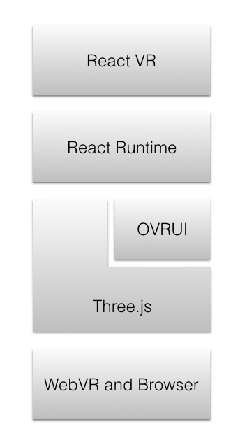

# React Native
# ×
# React VR 

---

## Profile

## @besutome


React Native Meetupの運営。
最近は仕事の代わりにペルソナ5やってます。

---

## React VR × React Native

---

## α版のReact VRがでたので、
## RNに組み込もうとしたけど無理でした

---

## React VR?

### 2016/10のOculusカンファレンスで発表

---

## 2016/12/13 Pre-Release

### [React VR | A framework for building VR apps using React](https://facebookincubator.github.io/react-vr/index.html)

---



+ OVRUI
+ Three.js
+ Web VR and Browser

---

## OVRUI
### Oculus用のツール

## Web VR and Browser
### Webで動かす(WebじゃないネイティブVRもある)

---

## *Web VR and Browser*ってあるのでRNに組み込むの無理くさい
###（資料作ってる時に気づきました）

---

## VR?

### 3Dのカメラ部分を現実から指定する

---

## 3Dのざっくりした説明

+ シーン
+ カメラ
+ 光源

---

## シーン

## 3D上の空間
### 物体等を配置する

---

## カメラ

## 3D空間の視点を決める

---

## 光源

### どこから光が当たっているかを指定する

---

## VR?

### 3Dのカメラ部分を現実から指定する

---

## ここに詳しくのってます

### [Introducing the React VR Pre-Release | Oculus](https://developer.oculus.com/blog/introducing-the-react-vr-pre-release/)

---

## がんばってRNに組もこもう

---

+ `npm i -g react-vr-cli`
+ `npm i -g react-native-cli`
+ `react-native init vrTest`
+ `react-vr-cli init hoge`
+ `cd vrTest`
+ `npm i react-vr react-vr-web three`

---

###  以下をコピー
  + `vr`
  + `static_assets`
  + `index.vr.js`
  + `rn-cli.config.js`
  + `postinstall.js`

---

### 注意点

+ ブラウザのユーザーエージェントをスマホにしても動かない
+ react native packagerを使ってる
  (RNをビルドする際のサーバーポートが被る)
+ `react-vr-cli`で生成されるパッケージ類のバージョンが古い
  (ソース公開されていないが、npm上ではアップデートされている）
+ `ovrui``ovr-audio`はOculus用のパッケージ
  
---

## Core Components

+ View
+ Image
+ Text

---

## VR Components

---

## Mesh

### 物体の質感を指定するもの

+ geometry: 形
+ material: 材質

---

## どちらでもいける

```js
<Mesh
  source={{mesh:'cube.obj', mtl:'cube.mtl'}}
/>

<Mesh
  source={{mesh:'cube.obj', texture:'cube.jpg'}}
/>
```

## Pano

### 3D空間上の背景を指定する

---

### 360度写真を使ったりも可能

```js
<Pano source={asset('chess-world.jpg')}/>
```

---

## Scene

### 空間の設定
### Scene上に物体が配置される

---

## AmbientLight

### オブジェクトに対し均等に光を当てる

---

## DirectionalLight 

### 方向を決めて光を当てる

---

## SpotLight 

### スポットライトのような光源

---

## VrButton

```js
<VrButton
  style={{width: 0.7}}
  onClick={()=>this._onViewClicked()}>
  <Image style={{width:1, height:1}}
    source={{uri:'../../Assets/Images/gaze_cursor_cross_hi.png'}}
    inset={[0.2,0.2,0.2,0.2]}
    insetSize={[0.05,0.45,0.55,0.15]} >
  </Image>
</VrButton>
```

---

## まとめ

### React VRはWebVR用の技術
### さすがにまだ使えません